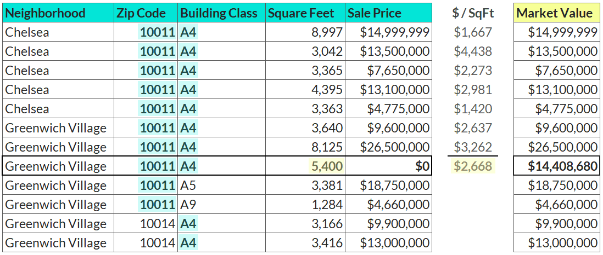

Your Objective
--------------

Your dataset contains property sales for one-family dwellings in Manhattan over the last 12 months, including each property's zip code, building class, square feet, and sale price. However, records have have a sale price of $0 whenever there was a transfer of ownership without a cash consideration (like from parents to children).

Your task is create a new market value column that uses the recorded sale price when available, or estimates it by using the average price per square foot from properties within the same zip code and building class.

See example below:

*BONUS: Can you impute by scraping the real market values from the internet based on each address?*

# Question
After imputing, how many total properties have an estimated market value greater than $15 million?

---

Original URL: https://mavenanalytics.io/data-drills/estimate-the-estate
