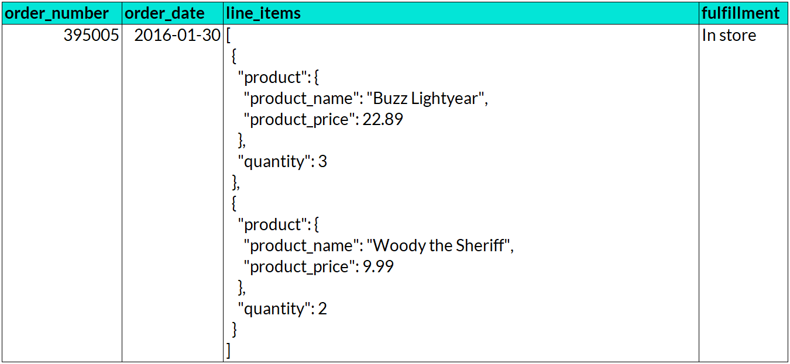
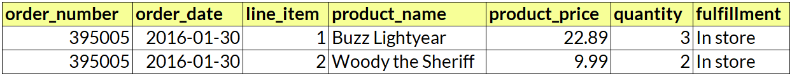

Your Objective
--------------

Flatten a column of nested JSON data by unpacking its list items into individual rows in a table.

For example, turn this order record with 2 nested line items:

Into these two records (1 per line item):

# Question
What is the sum of total online sales? (round to nearest integer)

---

Original URL: https://mavenanalytics.io/data-drills/flatten-the-stack
