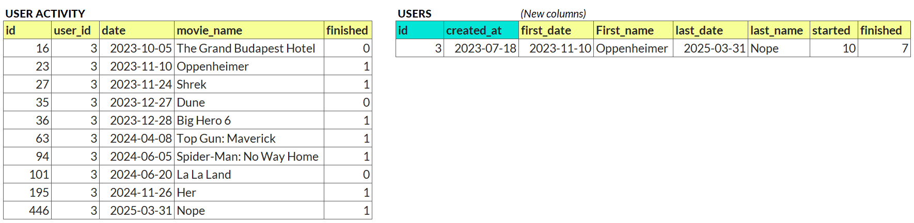

Your Objective
--------------

You've been given a table of Netflix users and another with their viewing activity, including the movie name, date started, and whether they finished it.

Your task is to engineer these new features for each user, based on their activity:

-   Date from the first movie they finished

-   Name of the first movie they finished

-   Date from the last movie they finished

-   Name of the last movie they finished

-   Movies started

-   Movies finished

*Example:*

# Question
How many users have "Fight Club" as the last film they've seen?

---

Original URL: https://mavenanalytics.io/data-drills/movie-metrics
