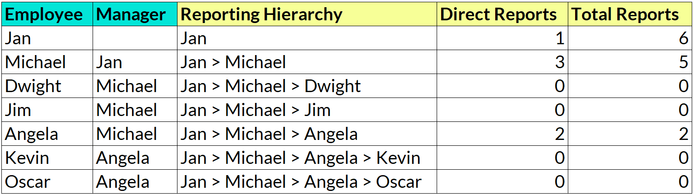

Your Objective
--------------

Unravel this parent-child hierarchy puzzle by mapping each employee's chain of command and calculating their direct and total reports.

Starting with a list of employees and their managers, your task is to create 3 new columns:

-   Reporting Hierarchy: The chain of command from the highest-ranking manager down to you

-   Direct Reports: The number of employees that report to you as their manager

-   Total Reports: The total number of employees beneath you in the reporting hierarchy (your direct reports, plus their direct reports, etc.)

*Example output:*

# Question
What is the sum of the "Total Reports" column?

---

Original URL: https://mavenanalytics.io/data-drills/org-chart-overhaul
