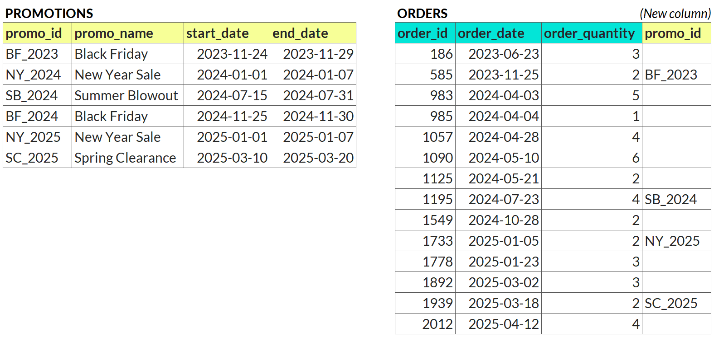

## Your Objective

You've been given two tables:

1. A table with promotional periods, each with a start and end date
2. A table with orders, each with an order date and quantity

Your task is to join each transaction to the promotion active on its order date.

*Example:*

## Question
How many orders were placed outside of promotional periods?

---

Original URL: https://mavenanalytics.io/data-drills/spot-the-sale
