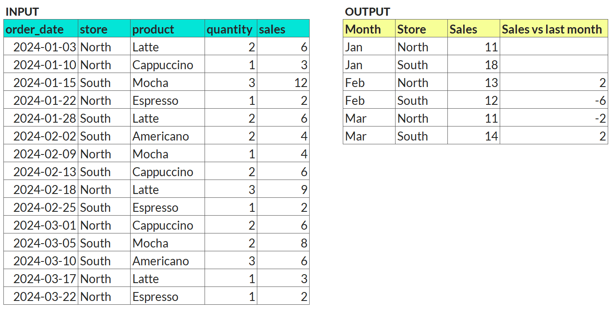

Your Objective
--------------

You've been given a table with raw data for individual coffee shop transactions. Your task is to aggregate the total sales by month and store, then calculate the month-over-month change in sales for each store *(in dollars)*.

*Example input and output:*

## Question

What was the difference in sales from April to May for the Astoria location? (digits only, rounded to the nearest dollar)

---

Original URL: https://mavenanalytics.io/data-drills/rolling-up-looking-back
