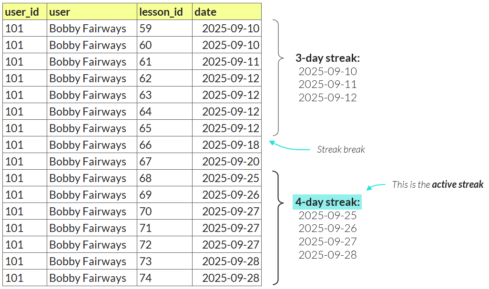

Your Objective
--------------

You work for a popular language learning company and have a table containing ~900,000 lesson completions, including the date, user, and lesson ID.

Your task is to calculate the active streak for each user, then create a leaderboard of the top 10 users with the longest active streaks.

-   The streak length is the number of consecutive days with at least one lesson completion

-   For the purpose of this drill, consider the current date to be 2025-09-29

-   For a streak to be considered "active", the user must have completed a lesson on 2025-09-28

See example below:

# Question
How long is the third longest active streak?

---

Original URL: https://mavenanalytics.io/data-drills/streak-leaderboard
