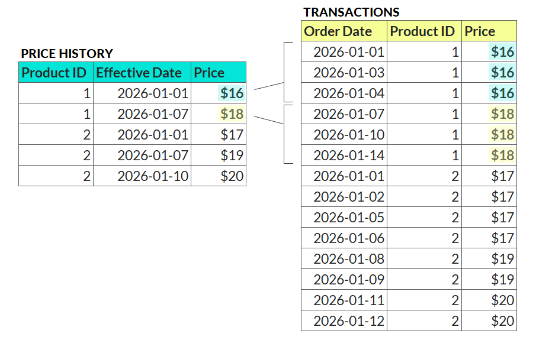

Your Objective
--------------

Your dataset contains three tables from a pizza restaurant:

1.  A transactions table with order date, product, and quantity

2.  A products table with the current price for each product

3.  A price history table with the price changes for each product over time

Your task is to look up the price for each product in the transactions table at that point in time, accurately reflecting the price changes.

*NOTE: If the effective date of a price change is equal to the order date for a transaction, then that is the price that should be reflected.*

See example below:

# Question
What is the total revenue from the transactions? (round down to nearest integer)

---
Original URL: https://mavenanalytics.io/data-drills/the-price-is-right
