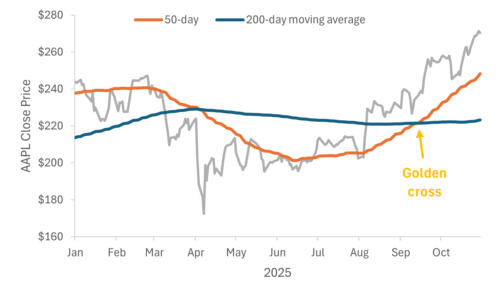
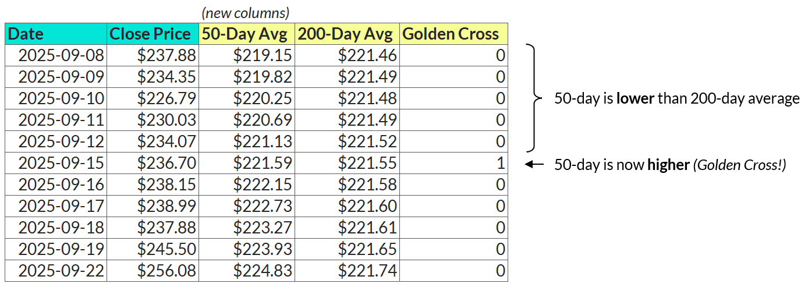

Your Objective
--------------

Your dataset for this drill contains daily closing prices for the SPDR S&P 500 ETF Trust (SPY) over the last 5 years.

Your task is to calculate the 50-day and 200-day moving averages based on the closing price, and identify every "Golden Cross" moment -- when the short-term average (50-day) crosses from below to above the long-term average (200-day) -- signaling a potential bull market.

To complete the drill, create a table containing the date, close price, and three new columns:

1.  50-day moving average: The average closing price for the last 50 trading days, calculated for each date

2.  200-day moving average: The average closing price for the last 200 trading days, calculated for each date

3.  Golden Cross: A binary field (1/0) that equals 1 only on the exact date when the 50-day average crosses from below the 200-day average; otherwise 0

## Question
What was the close price on the date of the most recent "golden cross"? (numbers only, no currency symbols)

---

Original URL: https://mavenanalytics.io/data-drills/turning-bullish
